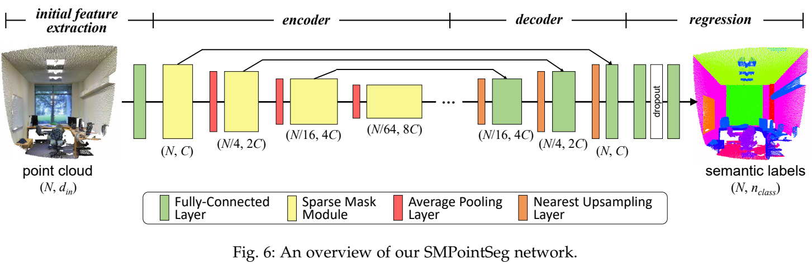
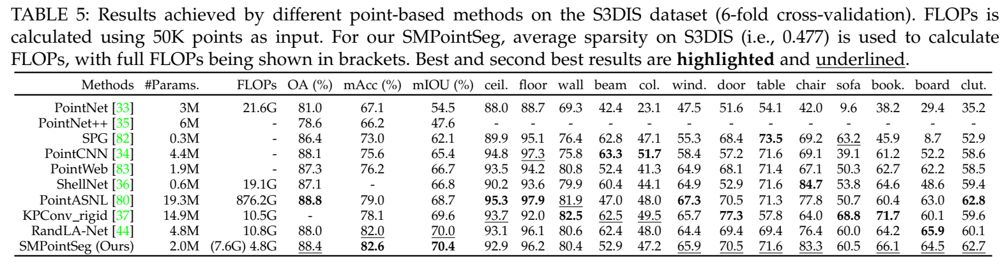
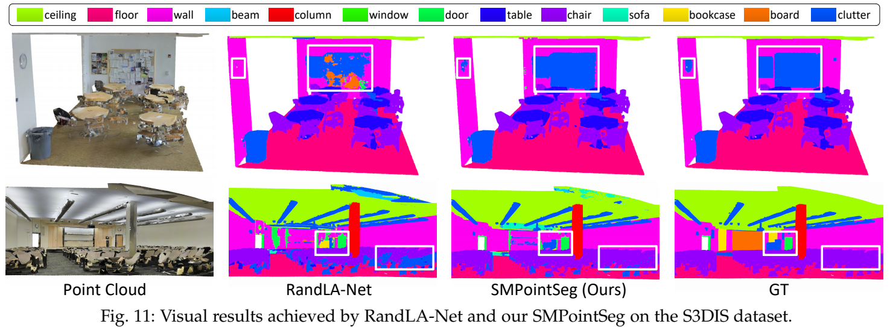

# SparseMask
Pytorch implementation of "Exploring Fine-Grained Sparsity in Convolutional Neural Networks for Efficient Inference", TPAMI 2022

[[Paper]](https://ieeexplore.ieee.org/document/9841044) 

## Motivation
- Connection between the sparsity in human brains and the sparsity in CNNs
<p align="center">  </p>

- Feature sparsity in CNNs 
<p align="center">  </p>


## Overview

- Sparse Mask Generation
<p align="center">  </p>

- Sparse Mask Convolution
<p align="center">  </p>


## Applications
### 1. Point Cloud Semgantic Segmentation [[code]](https://github.com/LongguangWang/SparseMask/tree/master/point_cloud_semantic_segmentation)

- Network Architecture
<p align="center">  </p>

- Results
<p align="center">  </p>

<p align="center">  </p>

### 2. Singe Image Super-Resolution [[code]](https://github.com/LongguangWang/SMSR)

- Network Architecture
<p align="center">  </p>

- Results
<p align="center">  </p>

<p align="center">  </p>

### 3. Stereo Matching

- Network Architecture
<p align="center">  </p>

- Results
<p align="center">  </p>

<p align="center">  </p>

## Citation
```
@Article{Wang2022Exploring,
  author  = {Longguang Wang and Yulan Guo and Xiaoyu Dong and Yingqian Wang and Xinyi Ying and Zaiping Lin and Wei An},
  title   = {Exploring Fine-Grained Sparsity in Convolutional Neural Networks for Efficient Inference},
  journal = {IEEE Transactions on Pattern Analysis and Machine Intelligence},
  year    = {2022},
}
```
