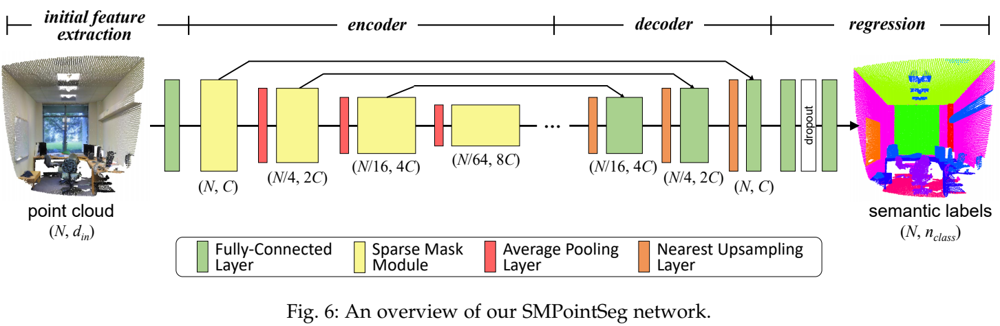
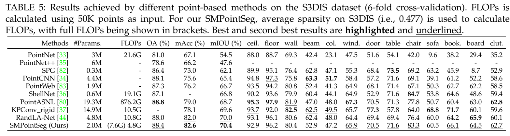
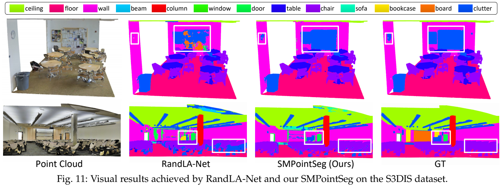
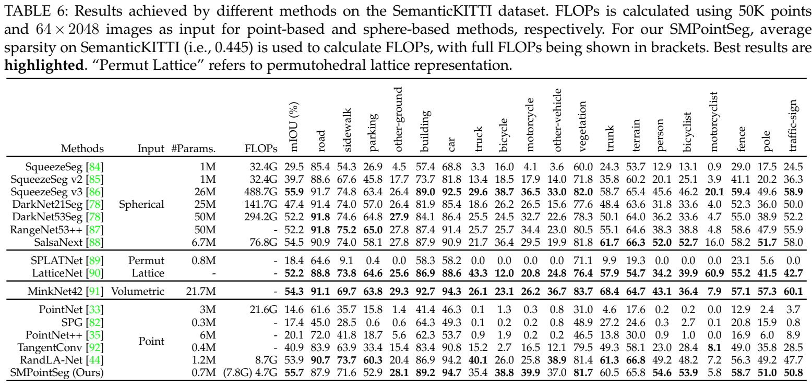
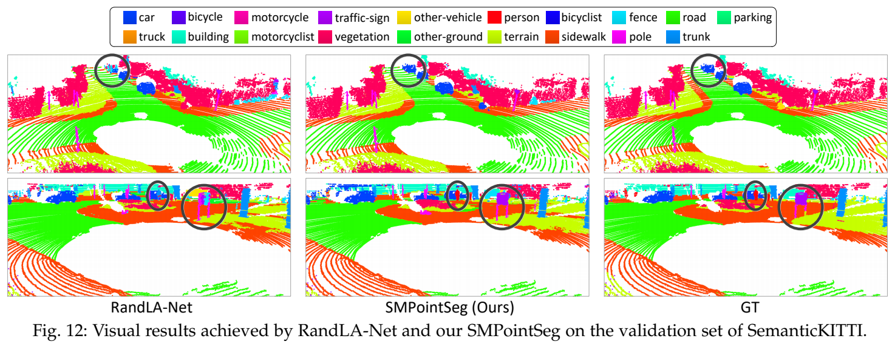

# SMPointSeg

## Network Architecture

<p align="center">  </p>

## Setup
### 1. Clone this repository
```shell
git clone https://github.com/LongguangWang/SparseMask && cd SparseMask
```

### 2. Install the following pacages
- cuda == 11.1
- PyTorch == 1.8.0
- prefetch_generator == 1.0.1
- numpy == 1.19.5
- open3d == 0.12.0
- scikit-learn == 0.24.2
- pandas == 1.2.4 

Our code is tested with the above environments.

### 3. Install the required operations.
Run `sh compile_op.sh` to install required opeartions.

## S3DIS
### 1. Prepare training data 
1.1 Download [the S3DIS datset](https://docs.google.com/forms/d/e/1FAIpQLScDimvNMCGhy_rmBA2gHfDu3naktRm6A8BPwAWWDv-Uhm6Shw/viewform?c=0&w=1) (Stanford3dDataset_v1.2_Aligned_Version.zip) and uncompress it to `your_dir_S3DIS`.

1.2 Run `sh data_prepare_S3DIS.sh` to prepare training data. Generated data will be stored in `your_dir_S3DIS_original` and `your_dir_S3DIS_sub0.040`. Please update `data_dir` in the bash file as `your_dir_S3DIS`.

### 2. Begin to train
Run `sh train_S3DIS.sh`. Please update `data_dir` in the bash file as `your_dir_S3DIS_sub0.040`.

### 3. Begin to test
Run `sh inference_S3DIS.sh`. Please update `data_dir` in the bash file as `your_dir_S3DIS_sub0.040`.

### 4. 6-fold cross validation
Run `sh 6_fold_S3DIS.sh`. Please update `data_dir` in the bash file as `your_dir_S3DIS_original`.

- Quantitative Results
<p align="center">  </p>

- Visual Results
<p align="center">  </p>


## SemanticKITTI
### 1. Prepare training data 
1.1 Download [the SemanticKITTI dataset](http://semantic-kitti.org/dataset.html#download) (files related to semantic segmentation) dataset and uncompress it to `your_dir_SemanticKITTI`.

1.2 Run `sh data_prepare_SematicKITTI.sh` to prepare training data. Generated data will be stored in `your_dir_SemanticKITTI_sequences_0.06`. Please update `data_dir` in the bash file as `your_dir_SemanticKITTI`.

### 2. Begin to train
Run `sh train_SematicKITTI.sh`. Please update `data_dir` in the bash file as `your_dir_SemanticKITTI_sequences_0.06`.

### 3. Begin to test
Run `sh inference_SematicKITTI.sh`. Please update `data_dir` in the bash file as `your_dir_SemanticKITTI_sequences_0.06`.

- Quantitative Results
<p align="center">  </p>

- Visual Results
<p align="center">  </p>

## Citation
```
@Article{Wang2022Exploring,
  author  = {Longguang Wang and Yulan Guo and Xiaoyu Dong and Yingqian Wang and Xinyi Ying and Zaiping Lin and Wei An},
  title   = {Exploring Fine-Grained Sparsity in Convolutional Neural Networks for Efficient Inference},
  journal = {IEEE Transactions on Pattern Analysis and Machine Intelligence},
  year    = {2022},
}
```

## Acknowledgements
Part of the code is borrowed from [RandLA-Net](https://github.com/QingyongHu/RandLA-Net), [RandLA-Net (PyTorch)](https://github.com/qiqihaer/RandLA-Net-pytorch) and [KPConv](https://github.com/HuguesTHOMAS/KPConv-PyTorch). We thank the authors for sharing the codes.

